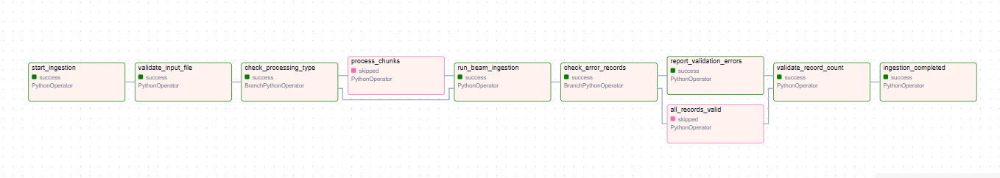
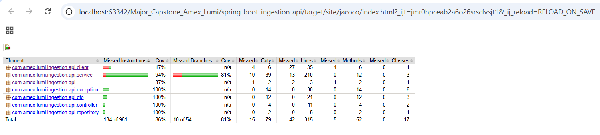

# Amex Lumi – Data Ingestion and Processing Pipeline

## 📌 Project Overview

The **Amex Lumi Data Ingestion Platform** is an end-to-end data ingestion and processing solution designed to ingest employee data from multiple file formats, validate and transform the data, encrypt sensitive information, load the data into PostgreSQL, and orchestrate the complete workflow using Apache Airflow.

The solution also supports:

- Large-file processing using PySpark
- Parallel processing of file chunks
- Record-count validation using control files
- Partial failure handling
- Error record generation
- Employee data decryption through a Spring Boot REST API
- API testing using Postman
- Automated testing using Pytest and JUnit
- Java code coverage using JaCoCo

---

## 1.Table of Contents

- [Technology Stack](#2-technology-stack)
- [Project Feature](#3-project-features)
- [Sensitive Data Encryption](#4-sensitive-data-encryption)
- [Employee Decryption API](#5-employee-decryption-aPI)
- [Metadata Enrichment](#6-metadata-enrichment)
- [Error Handling & Partial Failure](#7-error-handling-and-partial-failure)
- [Airflow Orchestration](#8-airflow-orchestration)
- [Large File Processing - Phase 2](#9-large-file-processing--phase-2)
- [PySpark File Splitter](#10-pySpark-file-splitter)
- [Record Count Validation – Phase 3](#11-record-count-validation-phase-3)
- [Spring Boot REST API](#12-spring-boot-rEST-aPI)
- [Database](#database)
- [Testing](#testing)
- [Project Structure](#project-structure)
- [End-to-End Flow](#end-to-end-flow)
- [How to Run the Project](#how-to-run-the-project)
- [Project Phases](#project-phases)
- [Future Enhancements](#future-enhancements)

# 2. Technology Stack

| Technology               | Purpose                                         |
|--------------------------|-------------------------------------------------|
| **Java 17**              | Java application and Apache Beam runtime        |
| **Spring Boot**          | REST API and application orchestration          |
| **Apache Airflow 2.9.3** | Workflow orchestration                          |
| **Apache Beam**          | File parsing, validation and database ingestion |
| **PySpark**              | Large-file splitting and partitioning           |
| **PostgreSQL 13**        | Target database                                 |
| **Docker**               | Containerization                                |
| **Docker Compose**       | Airflow environment setup                       |
| **Maven**                | Java build and dependency management            |
| **Python**               | Airflow DAG and PySpark                         |
| **Postman**              | API testing                                     |
---

# 3. Project Features

## 1. Multi-Format Data Ingestion

The platform supports ingestion of employee data from multiple input formats:

- CSV
- JSON

Apache Beam is used for parsing and processing the input records.

---

## 2.Data Normalization

Input records are normalized before being loaded into the database.

The pipeline handles:

- Null values
- Missing values
- Empty fields
- Standardization of input data

---

## 3. Employee Data Validation

Employee records are validated before database insertion.

Validation is performed against the required employee schema and field-level constraints.

Example fields include:

```text
employee_id
first_name
last_name
email
phone_number
hire_date
department
job_title
salary
currency
employment_status
manager_id
is_active
skills
address
```

Invalid records are separated from valid records and written to error files without stopping the complete ingestion process.

---

# 4. Sensitive Data Encryption

Sensitive employee fields are encrypted before being stored in PostgreSQL.

The encryption implementation uses:

```text
AES/GCM/NoPadding
```

with:

- SHA-256 based key generation
- 256-bit AES key
- 12-byte random IV
- 128-bit GCM authentication tag

The encrypted value is stored in the following format:

```text
Base64(IV):Base64(Encrypted Data)
```

Sensitive fields include:

- Phone number
- Salary
- Emergency phone number

---

# 5. Employee Decryption API

A separate Spring Boot REST API is provided to retrieve employee information and decrypt encrypted fields.

### API

```http
GET /api/decrypt/{employeeId}
```

Example:

```http
GET http://localhost:8080/api/decrypt/EMP001
```

---

# 6. Metadata Enrichment

Metadata is added to every successfully processed employee record.

The metadata includes:

### `ingestion_timestamp`

Timestamp representing when the record is ingested into the warehouse.

### `execution_id`

A UUID generated for every ingestion run.

All records processed during the same ingestion run receive the same execution ID.

### `source_creation_time`

Timestamp associated with the source file.

Example:

```text
employee_id
execution_id
ingestion_timestamp
source_creation_time
```

---

# 7. Error Handling and Partial Failure

The ingestion pipeline is designed to continue processing valid records even when some records are invalid.

For example:

```text
Input File
   │
   ├── Valid Record ──────► PostgreSQL
   │
   └── Invalid Record ────► Error File
```

This prevents a single invalid record from failing the complete ingestion process.

Error information is captured with meaningful validation/error details.

---

# 8. Airflow Orchestration

Apache Airflow is used to orchestrate the ingestion workflow.

The Airflow workflow is responsible for:

- Receiving ingestion parameters
- Reading file locations
- Handling small and large files
- Triggering Apache Beam processing
- Passing execution IDs
- Passing expected record counts
- Handling multiple file chunks
- Capturing Beam logs
- Generating error files
- Performing record-count validation

The Airflow environment is containerized using Docker Compose.



---

# 9. Large File Processing – Phase 2

Large files are processed differently from normal files to support parallel processing.

The Spring Boot API checks the input file size against a configurable threshold.

```text
Input File
     │
     ▼
Check File Size
     │
     ├─────────────── Small File
     │                    │
     │                    ▼
     │                 Airflow
     │
     └─────────────── Large File
                          │
                          ▼
                    PySpark Splitter
                          │
                          ▼
                    Smaller Chunks
                          │
                          ▼
                       Airflow
                          │
                          ▼
                 Parallel Beam Jobs
```

---

# 10. PySpark File Splitter

PySpark is used to split large input files into smaller chunks.

The splitter supports:

- Large CSV files
- Large JSON files

The purpose of splitting is to enable parallel processing and improve ingestion scalability.

Example:

```text
Large Input File
       │
       ▼
PySpark Splitter
       │
       ├── chunk_001
       ├── chunk_002
       ├── chunk_003
       └── chunk_004
              │
              ▼
       Parallel Processing
```

The chunk locations are then provided to the ingestion workflow.

---

# 11. Record Count Validation – Phase 3

The platform supports control-file based record-count validation.

The control file contains the expected record count.

Example:

```text
record_count=1000
```

The actual number of records processed by the ingestion pipeline is then compared with the expected count.

```text
Control File
     │
     ▼
Expected Record Count
     │
     ▼
Apache Beam Processing
     │
     ▼
Actual Record Count
     │
     ▼
Compare
     │
     ├── Match ───────► Continue BAU
     │
     └── Mismatch ────► Fail Ingestion
```

For CSV files, the header row is excluded from the record count.

When the expected and actual record counts do not match, the ingestion is failed with a clear indication of the expected and actual counts.

---

# 12. Spring Boot REST API

The Spring Boot application provides APIs for ingestion and employee decryption.

## Ingestion API

```http
POST /api/v1/ingestions
```

The API accepts:

- Input file
- Control file

The API:

1. Validates the request
2. Generates a unique execution ID
3. Checks the input file
4. Determines the file-processing path
5. Triggers the Airflow DAG
6. Passes the required parameters

---

## Decryption API

```http
GET /api/decrypt/{employeeId}
```

The API:

1. Receives employee ID
2. Fetches employee data from PostgreSQL
3. Identifies encrypted fields
4. Decrypts the fields
5. Returns complete employee information

---

# Database

The project uses **PostgreSQL** as the local data warehouse.

The database stores employee records along with ingestion metadata and encrypted sensitive fields.

Example database flow:

```text
Apache Beam
     ↓
PostgreSQL
     ↓
employee table
```

The Spring Boot application also uses PostgreSQL to fetch employee records for the decryption API.

---

# Testing

Testing has been implemented at different levels of the application.

## Java / Spring Boot Testing

Spring Boot components are tested using the Java testing framework and JaCoCo is used for code coverage analysis.

Testing includes components such as:

- Controllers
- Services
- Repository
- DTOs
- Exception handling
- Employee fetching
- Decryption functionality

The project achieved approximately:

```text
Instruction Coverage: 86%
Branch Coverage:      81%
```

---
# Project Structure

```text
Major-Capstone/
│
├── spring-boot-ingestion-api/
│   └── Spring Boot REST APIs
│
├── beam-ingestion/
│   └── Apache Beam ingestion pipeline
│
├── airflow/
│   └── Airflow DAGs and orchestration
│
├── pyspark-splitter/
│   └── PySpark large-file splitting
│
├── database/
│   └── Database scripts and schema
│
├── control-file/
│   └── Control files and record-count configuration
│
├── postman/
│   └── Postman API collection
│
├── README.md
│
└── .gitignore
```

---

# End-to-End Flow

The complete project flow can be summarized as:

```text
                    Input File
                        │
                        ▼
               Spring Boot API
                        │
                        ▼
                File Validation
                        │
                        ▼
                 File Size Check
                   /         \
                  /           \
             Small File     Large File
                 │              │
                 │              ▼
                 │        PySpark Splitter
                 │              │
                 │        Chunked Files
                 │              │
                 └──────┬───────┘
                        ▼
                     Airflow
                        │
                        ▼
                 Apache Beam
                        │
             ┌──────────┼──────────┐
             ▼          ▼          ▼
           Parse     Validate   Normalize
             │          │          │
             └──────────┼──────────┘
                        ▼
                    Encrypt
                        │
                        ▼
                 Add Metadata
                        │
                        ▼
                PostgreSQL
                        │
                        ▼
              Record Count Check
                        │
                  ┌─────┴─────┐
                  ▼           ▼
                Match      Mismatch
                  │           │
                  ▼           ▼
             BAU Continue    Fail
```

---

# Configuration

The Spring Boot application uses application configuration for:

- Database connection
- Airflow connection
- DAG configuration
- Large-file threshold
- Encryption secret

Sensitive configuration values should not be committed to GitHub.

For local development, configure the required properties in the local Spring Boot configuration file.

---

# How to Run the Project

## 1. Clone the Repository

```bash
git clone <repository-url>
cd Major-Capstone
```

---

## 2. Start PostgreSQL

Create the required database and employee table using the scripts provided in the `database` directory.

Verify the database connection before starting the application.

---

## 3. Start Airflow

Navigate to the Airflow directory:

```bash
cd airflow
```

Start the Docker Compose environment:

```bash
docker compose up -d
```

Verify the running containers:

```bash
docker ps
```

---

## 4. Build Apache Beam Project

Navigate to the Beam project:

```bash
cd beam-ingestion
```

Build the project using Maven:

```bash
mvn clean package
```

The generated JAR will be available under:

```text
target/
```

The `target` directory is a build output and is excluded from Git using `.gitignore`.

---

## 5. Start Spring Boot Application

Navigate to:

```text
spring-boot-ingestion-api
```

Run:

```bash
mvn spring-boot:run
```

The application runs on:

```text
http://localhost:8080
```

---

# API Endpoints

## Start Ingestion

```http
POST http://localhost:8080/api/v1/ingestions
```

### Request

Multipart form-data:

```text
fileLocation = <input file>
controlFile  = <control file>
```

---

---

# Project Phases

## Phase 1 – Core Data Ingestion

Implemented:

- Multi-format file ingestion
- Apache Beam processing
- CSV parsing
- JSON parsing
- XML parsing
- Fixed Width parsing
- Data normalization
- Employee validation
- Error record handling
- Metadata enrichment
- PostgreSQL loading
- Encryption
- Airflow orchestration
- Spring Boot ingestion API

---

## Phase 2 – Large File Processing

Implemented:

- Configurable file-size threshold
- Large-file detection
- PySpark file splitting
- Large CSV processing
- Large JSON processing
- Chunk generation
- Parallel chunk processing
- Integration between Spring Boot, PySpark and Airflow

---

## Phase 3 – Record Count Validation

Implemented:

- Control file support
- Expected record count
- Actual record count calculation
- Expected vs actual comparison
- CSV header handling
- Mismatch failure handling
- BAU continuation on successful validation

---

# Future Enhancements

Potential future enhancements include:

- Cloud deployment
- Google Cloud Storage integration
- Google Cloud Dataflow
- BigQuery integration
- Apache Beam runner deployment on cloud
- Improved monitoring and alerting
- Centralized logging
- Authentication and authorization for APIs 

---

# Author

**Manasvi Jain**